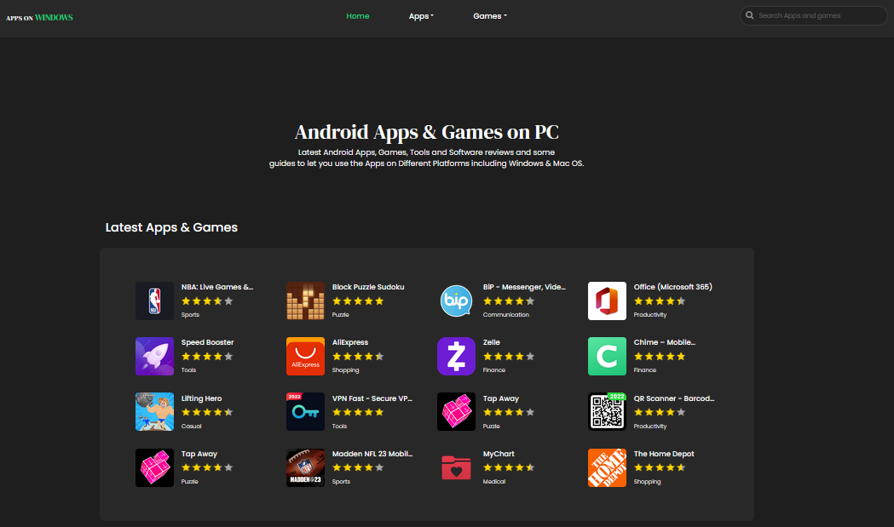
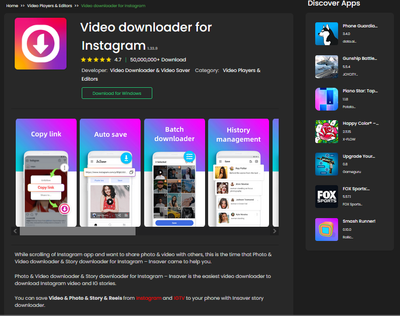
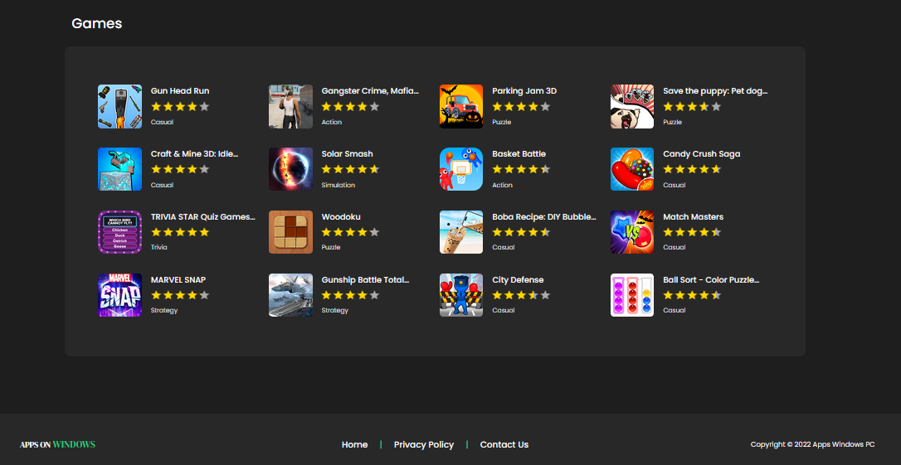
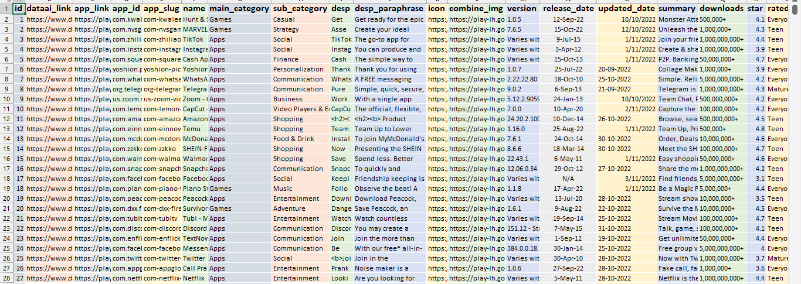
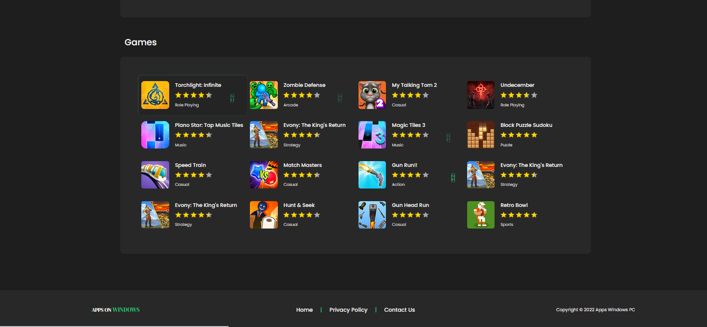
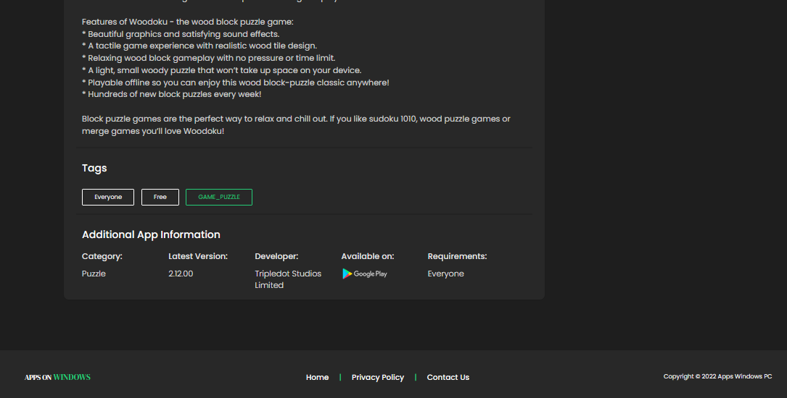
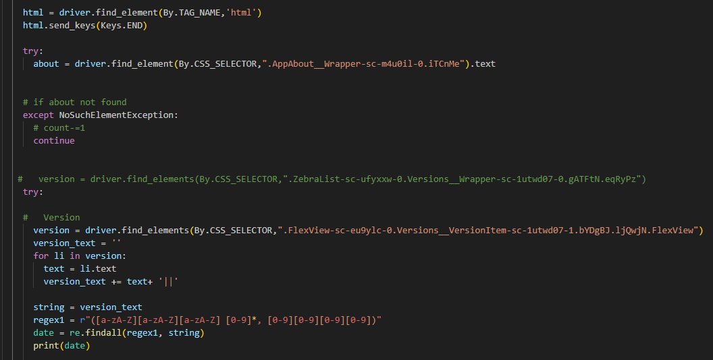

# EasyDownload Apps

Welcome to EasyDownload Apps, a curated collection of amazing applications brought to you with the power of technology. This project showcases my expertise in web development and data scraping, providing users with a seamless experience to discover and download their favorite apps effortlessly.

## Project Overview

EasyDownload Apps utilizes automation and data scraping techniques to gather app data from the Play Store using Selenium with Python. This data is then presented on a user-friendly website where visitors can browse through the collection and download apps with just a click.

### Key Features

- **Handpicked Collection**: Access a curated selection of amazing apps right at your fingertips.
- **Effortless Browsing**: Explore the collection with ease and find apps tailored to your preferences.
- **One-Click Downloads**: Download your favorite apps directly from the website hassle-free.
- **Visually Appealing Interface**: Enjoy a visually appealing and interactive browsing experience designed with HTML, CSS, Bootstrap, and JavaScript.

## Screenshots

## Technologies Used

- HTML5
- CSS
- Bootstrap
- JavaScript
- PHP
- Python (Selenium)
- MySQL

## Getting Started

To get started with EasyDownload Apps locally, follow these steps:

1. Clone the repository:
git clone https://github.com/HamadRizwan007/EasyDownload-Apps.git

2. Navigate to the project directory:
cd EasyDownload-Apps

## Contributing

Contributions are welcome! If you have ideas, suggestions, or improvements for EasyDownload Apps, feel free to open an issue or submit a pull request.

